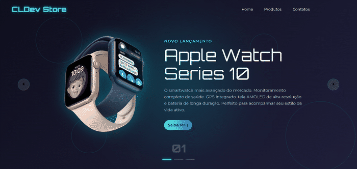
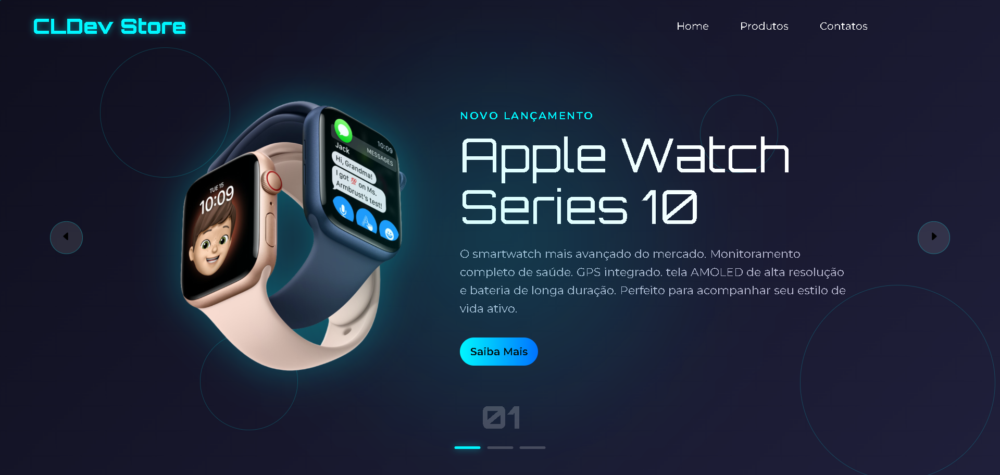
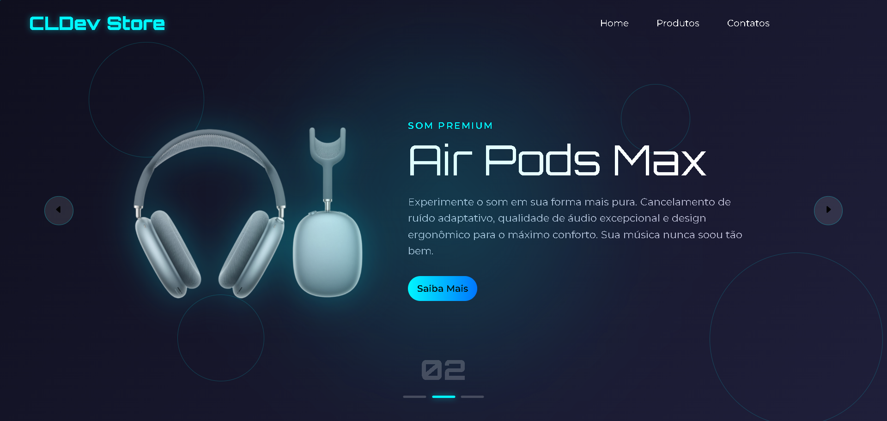
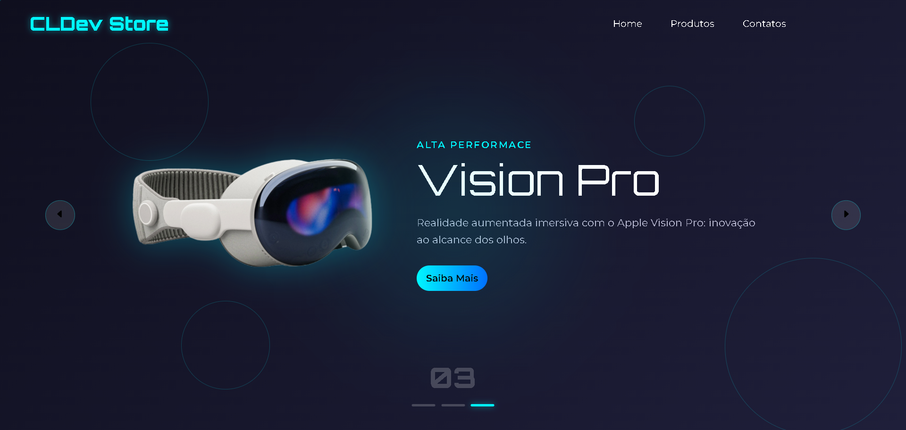

# 🛍️ CLDev Store

Uma landing page moderna inspirada na Apple, desenvolvida utilizando **HTML, CSS e JavaScript**. O projeto apresenta um carrossel interativo de produtos com animações suaves, design futurista e interface responsiva.

<p align="center">
  
</p>

---

## ✨ Funcionalidades

- 🎠 Carrossel de produtos desenvolvido em JavaScript
- 🎨 Interface moderna inspirada em lojas de tecnologia
- 📱 Layout responsivo
- ⚡ Navegação por botões anterior/próximo
- 💡 Efeitos visuais e animações
- 🖼️ Destaque para produtos em tela cheia

---

## 🖥️ Demonstração

### Apple Watch Series 10


### AirPods Max


### Apple Vision Pro


---

## 🚀 Tecnologias

- HTML5
- CSS3
- JavaScript (Vanilla JS)

---

## 📂 Estrutura do projeto

```
CLDev Store
│
├── capture/
│   ├── carrossel.gif
│   ├── 1.png
│   ├── 2.png
│   └── 3.png
│
├── img/
├── index.html
├── styles.css
├── script.js
└── README.md
```

---

## ▶️ Como executar

Clone o repositório:
```bash
git clone https://github.com/seu-usuario/cldev-store.git
```

Entre na pasta:
```bash
cd cldev-store
```

Abra o arquivo `index.html` em qualquer navegador.
Ou utilize a extensão **Live Server** do VS Code para desenvolvimento.

---

## 📚 Objetivo

Este projeto foi desenvolvido para praticar conceitos de desenvolvimento front-end, incluindo:

- Manipulação do DOM
- Eventos JavaScript
- Estruturação semântica em HTML
- Flexbox
- Responsividade
- Organização de componentes
- Animações utilizando CSS

---

## 🔮 Melhorias futuras

- Carrinho de compras
- Página individual dos produtos
- Integração com API
- Modo escuro/claro
- Menu mobile
- Filtros de produtos

---

## 👨‍💻 Autor

Desenvolvido por **Carlos Lima**

Se este projeto foi útil ou inspirador para você, considere deixar uma ⭐ no repositório.
